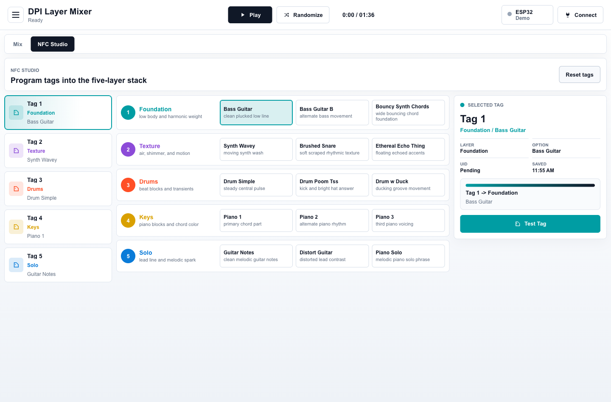

# DPI Layer Mixer

A physical-interface music system for my DPI course: NFC cards become musical layer tokens, rotary encoders become mixer controls, and a browser visualizer turns the whole hardware rig into a playable five-layer composition.



## What It Is

`DPI Layer Mixer` is a hybrid web app and ESP32 hardware controller. The browser plays a synced 96-second arrangement made from 15 compressed music stems, while the physical rig lets someone perform the mix with cards, knobs, and light.

The piece is built around five musical layers:

| Layer | Color | Physical role |
| --- | --- | --- |
| Foundation | Light blue | Bass and chord bed |
| Texture | Red | Atmosphere and secondary rhythm |
| Drums | Yellow | Percussion variations |
| Keys | Dark blue | Piano and harmonic choices |
| Solo | Orange | Lead phrases and guitar/piano moments |

Each layer has three possible musical options. A programmed NFC card tells the system which layer/option it represents. When the correct card is placed on the correct reader, that layer opens in the mix and its LED group lights up. Wrong-reader cards are rejected and marked red.

## Why I Built It

I wanted the final DPI project to feel less like a screen demo and more like an instrument: something legible to an audience, but still satisfying to physically operate. The core interaction is intentionally simple:

- Choose musical material by placing NFC cards.
- Shape the mix with rotary encoders.
- See state immediately through the browser and the LED strip.
- Keep the mapping honest: the right object has to be in the right physical place.

That creates a small ritual around building the composition. Instead of clicking tracks on and off, the performer assembles the song out of tangible pieces.

## Highlights

- **Five-channel stem engine**: React + Tone.js keeps 15 MP3 stems synced as one loopable composition.
- **NFC Studio**: a browser workflow for assigning, writing, testing, and debugging physical NTAG cards.
- **Real hardware bridge**: Web Serial connects the browser directly to an ESP32 controller.
- **Five-reader NFC rig**: PN532 readers in shared SPI mode, one reader per musical layer.
- **Rotary mixer**: KY-040 encoders adjust layer volume; wired button presses toggle mute where available.
- **LED feedback system**: a 25-LED WS2812B strip mirrors layer color, valid cards, wrong cards, volume, playback, and idle state.
- **Demo-friendly diagnostics**: the interface exposes serial feed, reader health, card payloads, write verification, and fallback states.

## Hardware

The current physical build uses:

- ESP32-WROOM-32 38-pin dev board
- 5x PN532 NFC readers in SPI mode
- 5x KY-040 rotary encoders
- 25 LED WS2812B / NeoPixel strip
- NTAG cards/stickers written with `dpi://v1/layer/<layer>/option/<option>` payloads

The LED data line is currently on GPIO22, reusing the Solo encoder's physical button pin. Solo still rotates for volume; only its press is sacrificed. The firmware also caps LED brightness/current because the full hardware stack is power-sensitive.

Full wiring and bring-up notes live in [`current/docs/hardware-wiring.md`](current/docs/hardware-wiring.md).

## Software Stack

```text
current/
  src/                         React + TypeScript app
  src/audio/StemMusicEngine.ts Tone.js stem playback engine
  src/input/                   Web Serial and mock input adapters
  src/components/              Mix UI, NFC Studio, controls, visualizer
  public/audio/dpi/            Browser-ready compressed MP3 stems
  DPI_2.ino                    ESP32 firmware for readers, encoders, LEDs
  docs/hardware-wiring.md      Hardware wiring and recovery notes
archive/
  legacy-shape-fork/           Earlier shape/color music experiment
```

The original Audacity/WAV working files are intentionally not included in GitHub. The repo includes the compressed stems needed to run the demo.

## Run The App

```bash
cd current
npm install
npm run dev -- --host 127.0.0.1 --port 5173
```

Open:

```text
http://127.0.0.1:5173/
```

The app works without hardware using the built-in mock controls. A Chromium-based browser is required for Web Serial when connecting the ESP32.

## Build And Check

```bash
cd current
npm run build
npm run lint
rm -rf /tmp/DPI_2 && mkdir -p /tmp/DPI_2
cp DPI_2.ino /tmp/DPI_2/DPI_2.ino
arduino-cli compile --fqbn esp32:esp32:esp32 /tmp/DPI_2
```

Upload to the ESP32, using the slower upload speed if the full hardware rig makes the USB serial link noisy:

```bash
arduino-cli compile --fqbn esp32:esp32:esp32:UploadSpeed=115200 --upload --port /dev/cu.usbserial-0001 /tmp/DPI_2
```

## Course Context

This repository is the public portfolio snapshot of my DPI course final project. It documents both the polished interface and the messy physical-computing work behind it: pin tradeoffs, serial protocols, NFC reliability, LED power limits, and the practical debugging needed to make a screen-based music system behave like a physical instrument.
