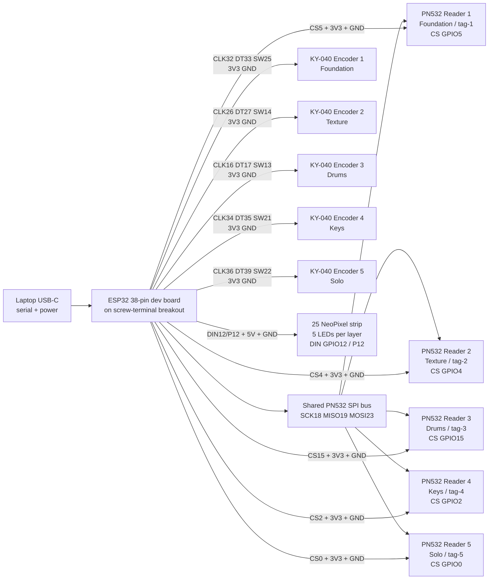

# DPI ESP32 Hardware Wiring

This wiring is for the 38-pin ESP32-WROOM-32 dev board on the screw-terminal breakout, five KY-040 rotary encoders, five PN532 NFC reader modules, and one 25-LED NeoPixel / WS2812B strip.

The current firmware lives at:

```text
DPI_2.ino
```

## Hardware Model

Each layer gets one encoder and one PN532 reader:

```text
Foundation  Encoder 1 + PN532 reader 1 -> tag-1
Texture     Encoder 2 + PN532 reader 2 -> tag-2
Drums       Encoder 3 + PN532 reader 3 -> tag-3
Keys        Encoder 4 + PN532 reader 4 -> tag-4
Solo        Encoder 5 + PN532 reader 5 -> tag-5
```

All five PN532 boards must be set to SPI mode. They share SCK, MISO, and MOSI. Each reader has its own CS / SS pin.

## Serial Protocol

The ESP32 sends app-readable lines at `115200` baud:

```text
LAYER:<layerId>:<optionId>
TAG:<tagId>:<uid>
BUTTON:<layerId>:PRESS
ENC:<layerId>:+1|-1
VOLUME:<layerId>:<0-100>
MUTE:<layerId>:0|1
READ_CARD:<tagId>:<uid>:<layerId>:<optionId>:<payload>
WRITE_READY:<tagId>:<payload>
WRITE_SUCCESS:<tagId>:<uid>:<layerId>:<optionId>
WRITE_UNVERIFIED:<tagId>:<uid>:<layerId>:<optionId>:<reason>
WRITE_FAIL:<tagId>:<reason>
TAG_UNSUPPORTED:<tagId>:<uid>:uid-length-{n}
```

`VOLUME` and `MUTE` lines come from the five rotary encoders. Turning an encoder changes that layer's volume in 4% steps, and pressing the encoder toggles mute. `TAG` lines come from the five PN532 readers and apply the matching NFC Studio assignment for `tag-1` through `tag-5`. `LAYER` lines are still accepted by the app for other hardware/input experiments, but the current encoder firmware does not use encoder turns for option selection.

The web app can also send:

```text
WRITE:<tagId>:<layerId>:<optionId>
VOLUME:<layerId>:<0-100>
```

The firmware writes an NTAG NDEF URI payload such as `dpi://v1/layer/drums/option/drum-w-duck`, tries to verify it by reading the card back, and reports the result through the NFC Studio hardware feed. If the PN532 ACKs the write but card memory readback is flaky, the firmware reports `WRITE_UNVERIFIED` so the app can still save the UID for the demo.

The app sends `VOLUME` commands whenever layer sliders or mutes change. The ESP32 maps those values to NeoPixel brightness.

## Wiring Diagram



## Shared PN532 SPI Wiring

Set every PN532 board to SPI mode first. On some boards this is a DIP switch; on Adafruit-style boards it is the SEL jumper setting.

Wire these pins to all five PN532 modules:

| PN532 pin | ESP32 pin | Notes |
| --- | --- | --- |
| VCC / 3V3 | 3V3 | Use 3.3V logic/power. If five readers are unstable, use an external 3.3V supply with common ground. |
| GND | GND | Shared ground with every encoder. |
| SCK | GPIO18 | Shared SPI clock. |
| MISO / SO | GPIO19 | Shared PN532-to-ESP32 data. |
| MOSI / SI | GPIO23 | Shared ESP32-to-PN532 data. |

Then wire each reader's chip-select pin separately:

| Layer | PN532 reader | PN532 CS / SS | Firmware tag id |
| --- | --- | ---: | --- |
| Foundation | Reader 1 | GPIO5 | `tag-1` |
| Texture | Reader 2 | GPIO4 | `tag-2` |
| Drums | Reader 3 | GPIO15 | `tag-3` |
| Keys | Reader 4 | GPIO2 | `tag-4` |
| Solo | Reader 5 | GPIO0 | `tag-5` |

GPIO0, GPIO2, GPIO4, GPIO5, and GPIO15 are ESP32 boot strapping pins. They are used here as CS lines because this build needs a lot of pins. Keep every PN532 CS line high during reset. If the ESP32 enters bootloader mode or fails to boot, unplug the Solo reader from GPIO0 while resetting, then reconnect after boot.

## Encoder Wiring

Wire every KY-040 `VCC` or `+` pin to ESP32 `3V3`, and every `GND` pin to ESP32 `GND`. `SW` is only the push button used for mute; rotation works without `SW` connected.

| Layer | KY-040 CLK | KY-040 DT | KY-040 SW | Firmware layer id |
| --- | ---: | ---: | ---: | --- |
| Foundation | GPIO32 | GPIO33 | GPIO25 | `foundation` |
| Texture | GPIO26 | GPIO27 | GPIO14 | `texture` |
| Drums | GPIO16 | GPIO17 | GPIO13 | `drums` |
| Keys | GPIO34 | GPIO35 | GPIO21 | `keys` |
| Solo | GPIO36 | GPIO39 | GPIO22 | `solo` |

GPIO34, GPIO35, GPIO36, and GPIO39 are input-only pins and do not provide internal pullups. They are only used for encoder CLK/DT signals here. If the Keys or Solo encoders feel unstable, add external 10k pullup resistors from those CLK/DT lines to 3V3.

The firmware reverses the rotation direction for encoders 2 through 5 so the physical direction matches the UI volume direction with the current wiring.

If the app connects to the ESP32 but rotating an encoder prints no `ENC:<layer>:+1/-1` or `VOLUME:<layer>:<0-100>` lines in Hardware Feed, test only the Foundation encoder first: `+` to `3V3`, `GND` to `GND`, `CLK` to GPIO32, and `DT` to GPIO33. If that still prints nothing, check the KY-040 pin labels, common ground, power, and screw-terminal row before debugging the browser UI.

## NeoPixel Strip Wiring

The firmware expects a 25 LED WS2812B / NeoPixel strip. The strip is split into five groups of five LEDs. This build has `NEOPIXEL_REVERSE_LAYER_ORDER` enabled because the installed strip runs opposite the UI order.

| LEDs | Layer | Color |
| --- | --- | --- |
| 0-4 | Solo / Reader 5 | Orange |
| 5-9 | Keys / Reader 4 | Dark blue |
| 10-14 | Drums / Reader 3 | Yellow |
| 15-19 | Texture / Reader 2 | Red |
| 20-24 | Foundation / Reader 1 | Light blue |

Wire the strip like this:

| NeoPixel strip | ESP32 / power | Notes |
| --- | --- | --- |
| DIN / DI | GPIO12 / P12 | Add a 330-470 ohm resistor in series if you have one. |
| GND | GND | Must share ground with ESP32 and external LED power. |
| 5V | External 5V recommended | 25 LEDs can pull more current than the ESP32 5V pin should provide at high brightness. |

GPIO12 is an ESP32 boot strapping pin. With this many modules there is no clean unused safe output left, so the current build keeps NeoPixel data on P12. If flashing or booting becomes unreliable, unplug NeoPixel DIN while uploading, or add a 10k pulldown from P12 to GND plus a 330-470 ohm series resistor between P12 and strip DIN. Moving the strip to another safe GPIO requires giving up or remapping one button/reader pin.

## NFC Recognition Stability

Five PN532 readers on one ESP32 can become marginal if the RF field or power rail is weak. For reliable NTAG215 reads:

- Power the PN532 boards from a solid 3.3V supply, not only a weak dev-board regulator, and tie the supply ground to ESP32 GND.
- Add a 470uF capacitor across the PN532 power rail near the reader cluster.
- Keep SCK, MISO, MOSI, CS, and GND wires short; run a ground wire near the SPI signal bundle.
- Keep PN532 antennas separated from each other, the NeoPixel power wire, metal, laptops, and phone cases.
- Hold sticker tags flat and centered over the antenna; large NTAG215 stickers can read worse at the edge of some cheap PN532 coils.
- Test one reader and one tag alone first. If one reader is much weaker than the others, swap the PN532 module rather than chasing code.

## First Bring-Up

1. Set all five PN532 boards to SPI mode.
2. Flash `DPI_2.ino` to the ESP32 at `115200` baud.
3. Open the web app, go to NFC Studio, click ESP32, and choose the serial port.
4. Confirm each reader prints a `found PN5...` firmware line in the Hardware Feed.
5. Turn each encoder and confirm lines like `ENC:foundation:+1` and `VOLUME:foundation:84`.
6. Press each encoder and confirm lines like `BUTTON:foundation:PRESS`, `MUTE:foundation:1`, and `VOLUME:foundation:0`.
7. Place an NFC tag on each reader and confirm lines like `TAG:tag-1:04:A1:B2:C3:D4:E5:80`.
8. Confirm the NeoPixel strip flashes all five layer colors at boot, then settles to one center LED per layer. Move layer volume sliders and confirm the groups brighten/dim in light blue, red, yellow, dark blue, and orange.
9. To program a card, select a reader slot and option in NFC Studio, click Write NTAG Card, hold the card on that reader, and wait for `WRITE_SUCCESS` or `WRITE_UNVERIFIED`.

## Pins To Avoid

Avoid ESP32 GPIO6 through GPIO11. They are connected to the board's flash memory on typical ESP32-WROOM-32 dev boards.

Avoid using GPIO34, GPIO35, GPIO36, and GPIO39 for outputs or button pins that need internal pullups. They are input-only.
