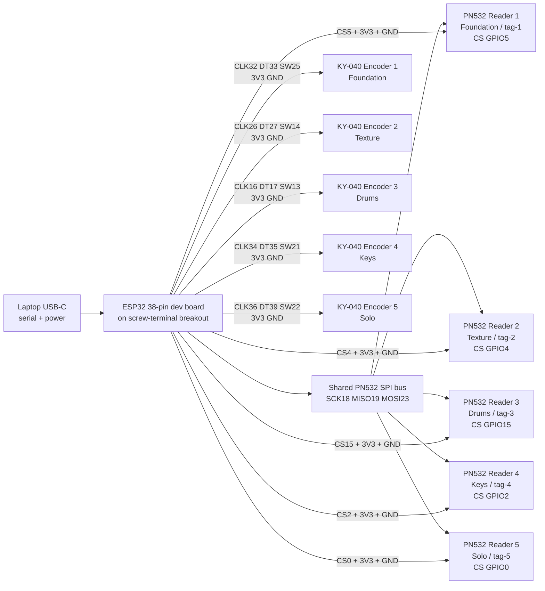

# DPI ESP32 Hardware Wiring

This wiring is for the 38-pin ESP32-WROOM-32 dev board on the screw-terminal breakout, five KY-040 rotary encoders, and five PN532 NFC reader modules.

The current firmware lives at:

```text
DPI_2.ino
```

## Hardware Model

Each layer gets one encoder and one PN532 reader:

```text
Foundation  Encoder 1 + PN532 reader 1 -> tag-1
Texture     Encoder 2 + PN532 reader 2 -> tag-2
Drums       Encoder 3 + PN532 reader 3 -> tag-3
Keys        Encoder 4 + PN532 reader 4 -> tag-4
Solo        Encoder 5 + PN532 reader 5 -> tag-5
```

All five PN532 boards must be set to SPI mode. They share SCK, MISO, and MOSI. Each reader has its own CS / SS pin.

## Serial Protocol

The ESP32 sends app-readable lines at `115200` baud:

```text
LAYER:<layerId>:<optionId>
TAG:<tagId>:<uid>
BUTTON:<layerId>:PRESS
READ_CARD:<tagId>:<uid>:<layerId>:<optionId>:<payload>
WRITE_READY:<tagId>:<payload>
WRITE_SUCCESS:<tagId>:<uid>:<layerId>:<optionId>
WRITE_FAIL:<tagId>:<reason>
TAG_UNSUPPORTED:<tagId>:<uid>:uid-length-{n}
```

`LAYER` lines come from encoder turns and directly select one of the three options for that layer. `TAG` lines come from the five PN532 readers and apply the matching NFC Studio assignment for `tag-1` through `tag-5`.

The web app can also send:

```text
WRITE:<tagId>:<layerId>:<optionId>
```

The firmware writes an NTAG NDEF URI payload such as `dpi://v1/layer/drums/option/drum-w-duck`, verifies it by reading the card back, and reports the result through the NFC Studio hardware feed.

## Wiring Diagram



## Shared PN532 SPI Wiring

Set every PN532 board to SPI mode first. On some boards this is a DIP switch; on Adafruit-style boards it is the SEL jumper setting.

Wire these pins to all five PN532 modules:

| PN532 pin | ESP32 pin | Notes |
| --- | --- | --- |
| VCC / 3V3 | 3V3 | Use 3.3V logic/power. If five readers are unstable, use an external 3.3V supply with common ground. |
| GND | GND | Shared ground with every encoder. |
| SCK | GPIO18 | Shared SPI clock. |
| MISO / SO | GPIO19 | Shared PN532-to-ESP32 data. |
| MOSI / SI | GPIO23 | Shared ESP32-to-PN532 data. |

Then wire each reader's chip-select pin separately:

| Layer | PN532 reader | PN532 CS / SS | Firmware tag id |
| --- | --- | ---: | --- |
| Foundation | Reader 1 | GPIO5 | `tag-1` |
| Texture | Reader 2 | GPIO4 | `tag-2` |
| Drums | Reader 3 | GPIO15 | `tag-3` |
| Keys | Reader 4 | GPIO2 | `tag-4` |
| Solo | Reader 5 | GPIO0 | `tag-5` |

GPIO0, GPIO2, GPIO4, GPIO5, and GPIO15 are ESP32 boot strapping pins. They are used here as CS lines because this build needs a lot of pins. Keep every PN532 CS line high during reset. If the ESP32 enters bootloader mode or fails to boot, unplug the Solo reader from GPIO0 while resetting, then reconnect after boot.

## Encoder Wiring

Wire every KY-040 `VCC` pin to ESP32 `3V3`, and every `GND` pin to ESP32 `GND`.

| Layer | KY-040 CLK | KY-040 DT | KY-040 SW | Firmware layer id |
| --- | ---: | ---: | ---: | --- |
| Foundation | GPIO32 | GPIO33 | GPIO25 | `foundation` |
| Texture | GPIO26 | GPIO27 | GPIO14 | `texture` |
| Drums | GPIO16 | GPIO17 | GPIO13 | `drums` |
| Keys | GPIO34 | GPIO35 | GPIO21 | `keys` |
| Solo | GPIO36 | GPIO39 | GPIO22 | `solo` |

GPIO34, GPIO35, GPIO36, and GPIO39 are input-only pins and do not provide internal pullups. They are only used for encoder CLK/DT signals here. If the Keys or Solo encoders feel unstable, add external 10k pullup resistors from those CLK/DT lines to 3V3.

## First Bring-Up

1. Set all five PN532 boards to SPI mode.
2. Flash `DPI_2.ino` to the ESP32 at `115200` baud.
3. Open the web app, go to NFC Studio, click ESP32, and choose the serial port.
4. Confirm each reader prints a `found PN5...` firmware line in the Hardware Feed.
5. Turn each encoder and confirm lines like `LAYER:foundation:bass-guitar-b`.
6. Press each encoder and confirm lines like `BUTTON:foundation:PRESS`.
7. Place an NFC tag on each reader and confirm lines like `TAG:tag-1:04:A1:B2:C3:D4:E5:80`.
8. To program a card, select a reader slot and option in NFC Studio, click Write NTAG Card, hold the card on that reader, and wait for `WRITE_SUCCESS`.

## Pins To Avoid

Avoid ESP32 GPIO6 through GPIO11. They are connected to the board's flash memory on typical ESP32-WROOM-32 dev boards.

Avoid using GPIO34, GPIO35, GPIO36, and GPIO39 for outputs or button pins that need internal pullups. They are input-only.
